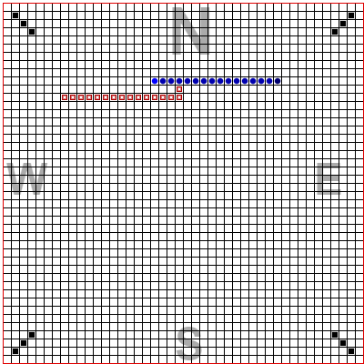

## This is a multiplayer snake game written in Elixir, using Pheonix LiveView, and SVG.

Play online [against one computer](https://evening-eyrie-25210-f2edb2eac607.herokuapp.com/Snake-Game/Player-1) player. Use arrow keys for direction, and the space-bar to jump. Note that heavy use of SVG makes playing on mobile choppy.

To run locally:
  * Run `mix setup` to install and setup dependencies
  * Start Phoenix endpoint with `mix phx.server` or inside IEx with `iex -S mix phx.server`
  * Compiles on Windows with Elixir 1.15.2, and runs on Heroku

Now you can visit [`localhost:4000`](http://localhost:4000) from your browser.

-------------------------------

Follow steps below to launch the debugging observer, from https://elixir-lang.org/getting-started/debugging.html#observer

     > iex.bat -S mix phx.server

Then load the dependencies and finally start it.

              iex> Mix.ensure_application!(:wx) 
              iex> Mix.ensure_application!(:runtime_tools)
              iex> Mix.ensure_application!(:observer) 

              iex> :observer.start()

-------------------------------

### The program uses these processes to create multiple games from the single CollectParticipants server

-------------------------------

### Game options

### Can choose to have the game slowly rotate

### Jump with space-bar or click the jumping man icon

### After a crash, a dead users segments are hollowed out.

### The head of the winner's snake is zoomed in on, as is blue below, at the end of the game

